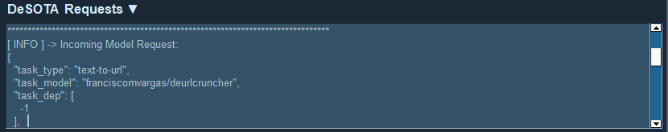

<details open>
   <summary><h1>DeRunner Overview</h1></summary>

[](https://github.com/DeSOTAai/DeManagerTools#models--tools-dashboard)

Derunner consists on a python scrip running as service to:
 - Serve as main client for DeSOTA API Models Request, for example `DeSOTA Tools` (eg. [DeUrlCruncher](https://github.com/franciscomvargas/DeUrlCruncher)) and `DeSOTA AI Models` (eg. [DeScraper](https://github.com/franciscomvargas/descraper), [NeuralQA](https://github.com/franciscomvargas/neuralqa));
 - Automatically Upgrade `DeSOTA Tools` and `DeSOTA AI Models`;
 - Automatically Re-Install `DeSOTA Tools` and `DeSOTA AI Models` on critical errors.

</details>

<details open>
    <summary><h1>Instalation</h1></summary>
    

## Use DeSOTA official [Manager & Tools](https://github.com/DeSOTAai/DeManagerTools#instalation)

[](https://desota.net/assistant/download.php?file=demanagertools&system=win)


<details>
    <summary><h2>Manual Windows Instalation</h2></summary>

### Installer Description:

* If model allready installed this installer function as upgrade, since the the installer webrequest newest installer from github - Take a look into [Installer Optional Arguments](#installer-optional-arguments)
* Install python if not exist
* Download miniconda, git and nssm as portables to Desota Folder
* Clone GitHub Repository
* Create a virtual environment with miniconda
* Start Server after instalation - Take a look into [Installer Optional Arguments](#installer-optional-arguments)

### Installer Procedure:

* Go to CMD (command prompt):
    * <kbd>⊞ Win</kbd> + <kbd>R</kbd>
    * Enter: `cmd` 

* Copy-Paste the following comand: 
    ```cmd
    powershell -command "Invoke-WebRequest -Uri https://github.com/desotaai/derunner/raw/main/Executables/Windows/DeRunner.install.bat -OutFile ~\derunner_installer.bat" && call %UserProfile%\derunner_installer.bat && del %UserProfile%\derunner_installer.bat

    ```
### Installer Optional Arguments:

<table>
    <thead>
        <tr>
            <th>arg</th>
            <th>Description</th>
        </tr>
    </thead>
    <tbody>
        <tr>
            <td rowspan=3>/reinstall</td>
            <td>Overwrite project when re-installing</td>
        </tr>
        <tr>
            <td>Delete project service when re-installing</td>
        </tr>
        <tr>
            <td>Install without requiring user interaction</td>
        </tr>
        <tr>
            <td>/startmodel</td>
            <td>Start project service after instalation</td>
        </tr>
    </tbody>
</table>

`Install with overwrite permission and start service after instalation`

```cmd
powershell -command "Invoke-WebRequest -Uri https://github.com/desotaai/derunner/raw/main/Executables/Windows/DeRunner.install.bat -OutFile ~\derunner_installer.bat" && call %UserProfile%\derunner_installer.bat /reinstall /startmodel && del %UserProfile%\derunner_installer.bat

```
    
    
</details>
</details>

<details open>
    <summary><h1>Service Operations</h1></summary>

<details open>
    <summary><h2>Windows</h2></summary>

* Go to CMD (command prompt):
  * <kbd>⊞ Win</kbd> + <kbd>R</kbd>
  * Search: `cmd` 
  * <kbd>Ctrl</kbd> + <kbd>⇧ Shift</kbd> + <kbd>↵ Enter</kbd>

### Start Service
* Copy-Paste the following comands: 
    ```cmd
    %UserProfile%\Desota\DeRunner\executables\Windows\derunner.start.bat

    ```
### Stop Service
* Copy-Paste the following comands: 
    ```cmd
    %UserProfile%\Desota\DeRunner\executables\Windows\derunner.stop.bat

    ```
</details>
</details>

<details open>
    <summary><h1>Uninstalation</h1></summary>

## Use DeSOTA official [Manager Tools](https://github.com/DeSOTAai/DeManagerTools#models--tools-dashboard)

<details>
    <summary><h2>Manual Windows Uninstalation</h2></summary>

### Uninstaller Description:

* Delete Service
* Delete DeRunner Folder

### Uninstaller Procedure:

* Go to CMD (command prompt):
    * <kbd>⊞ Win</kbd> + <kbd>R</kbd>
    * Enter: `cmd` 

* Copy-Paste the following comands: 
    ```cmd
    %UserProfile%\Desota\DeRunner\executables\Windows\derunner.uninstall.bat

    ```
    * Uninstaller Optional `Arguments`

        |arg|Description|
        |---|---|
        |/Q|Uninstall without requiring user interaction|
        
        `Uninstall Quietly`
        
        ```cmd
        %UserProfile%\Desota\Desota_Models\NeuralQA\neuralqa\executables\Windows\neuralqa.uninstall.bat /Q

        ```
      
</details>
</details>

<details open>
    <summary><h1>Credits / Lincense</h1></summary>

## [DeSOTA](#coming-soon)
```sh
@credit{
  ai2023desota,
  title = "DeRunner: Main Runner for Desota Servers",
  authors = ["Kristian Atanasov", "Francisco Vargas"],
  url = "https://github.com/desotaai/derunner/",  #eventually the desota webpage
  year = 2023
}
```
</details>

